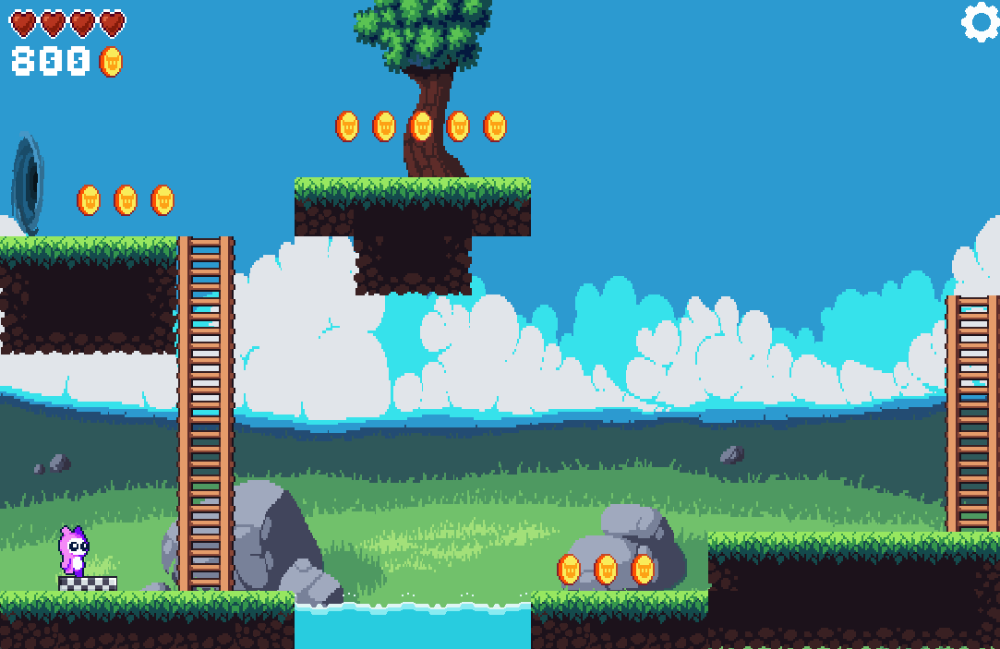
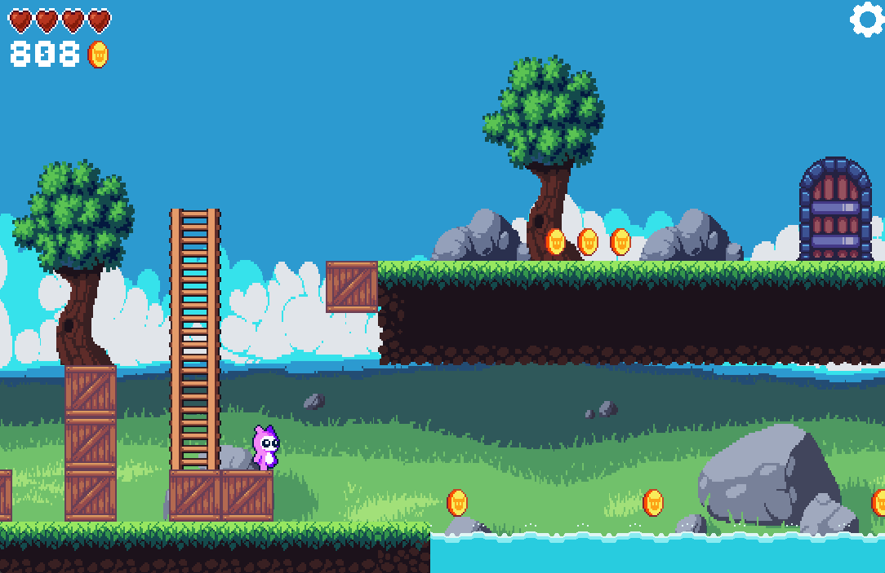
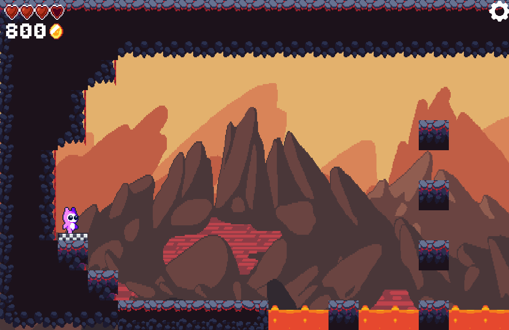
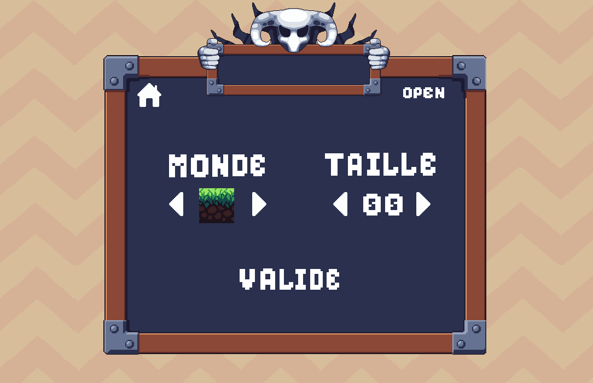
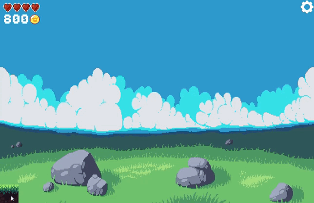
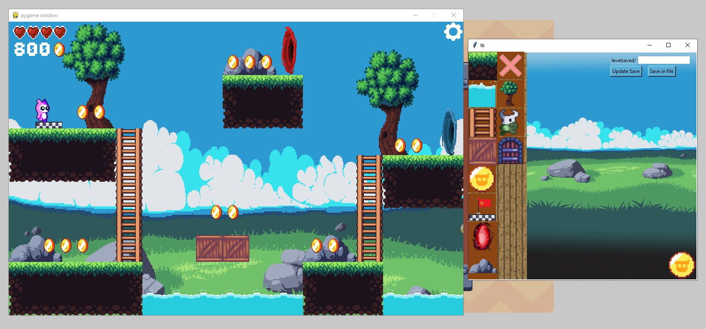
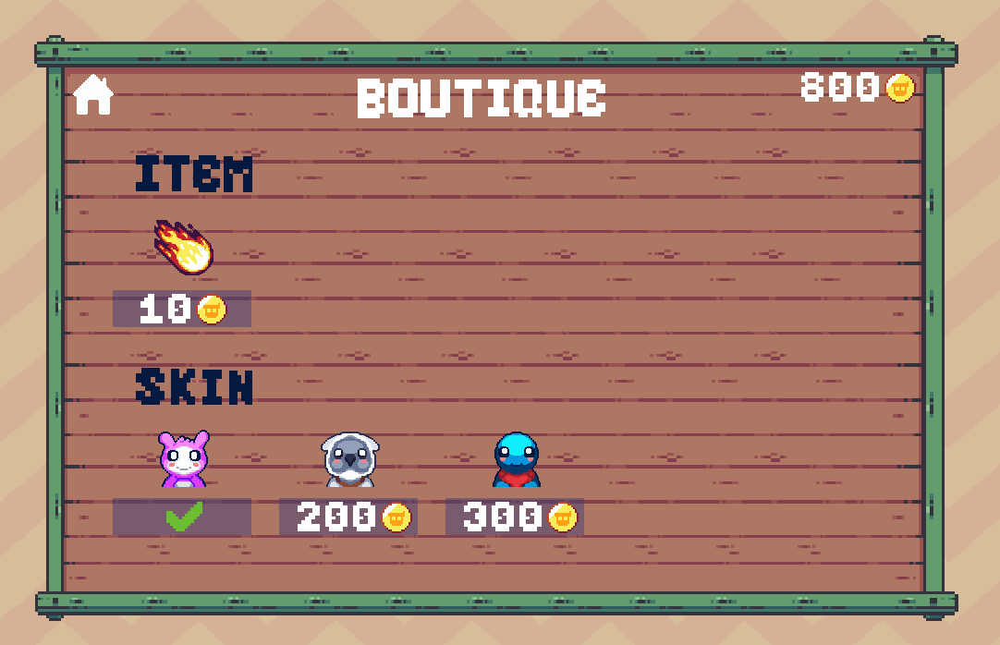

# Projet - Jeu Pygame

## Introduction
- Projet réalisé en première pour le cours de NSI 
- codé avec python 
- librairies utilisées : pygame, time 

## Visuel
- Au démarrage du jeu, on trouve le menu  

### Plusieurs possibilités se présente au joueur:

#### Jouer à des niveaux existants

### Exemple de gameplay

### Exemple de niveaux

### Créer ses propres niveaux

### Acheter des Skins

## Comment installer le jeu

- installer tous les fichiers
- installer les librairies pygame et tkinter
- lancer le fichier main

